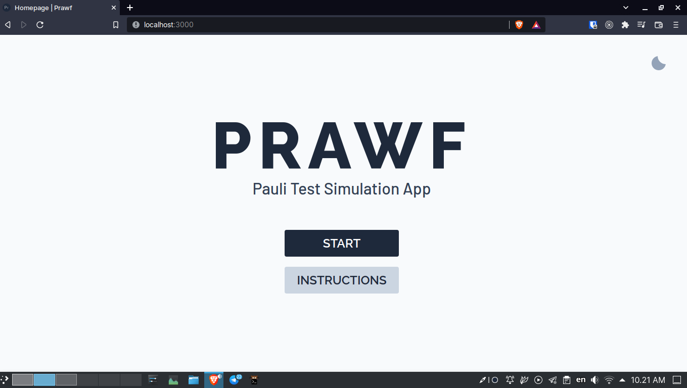
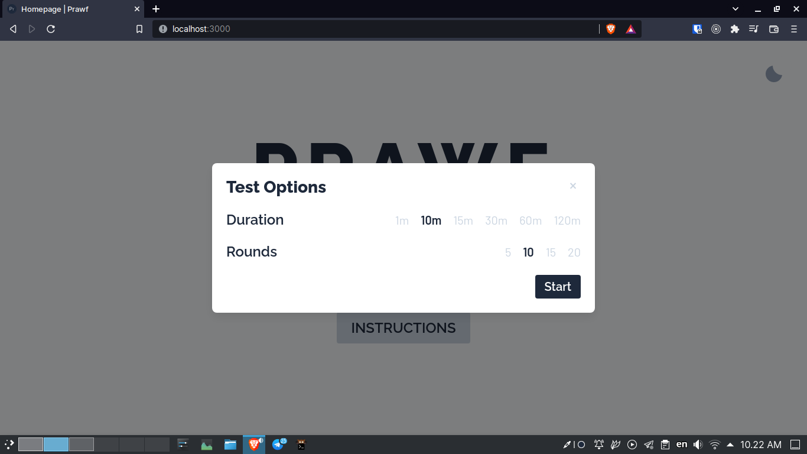
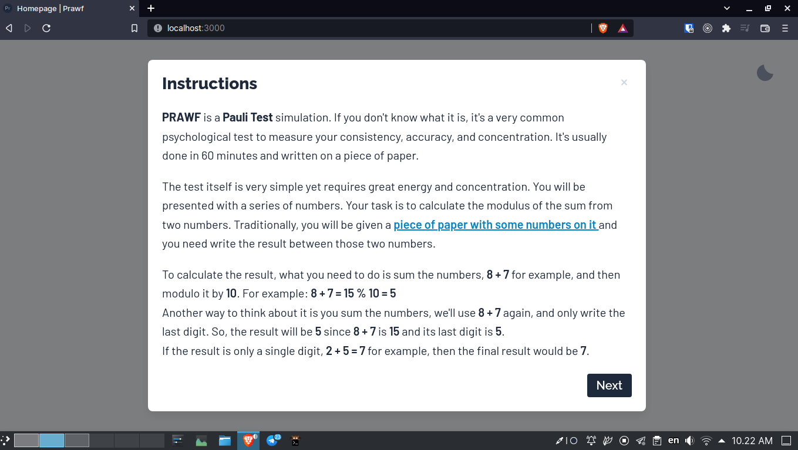
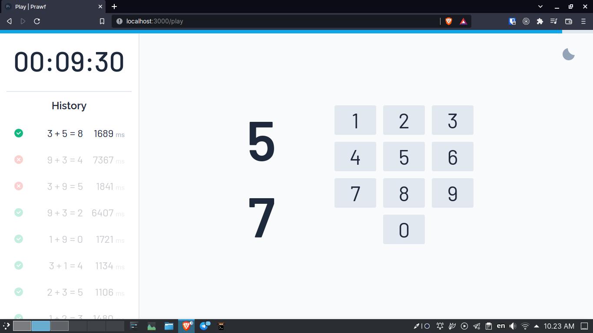
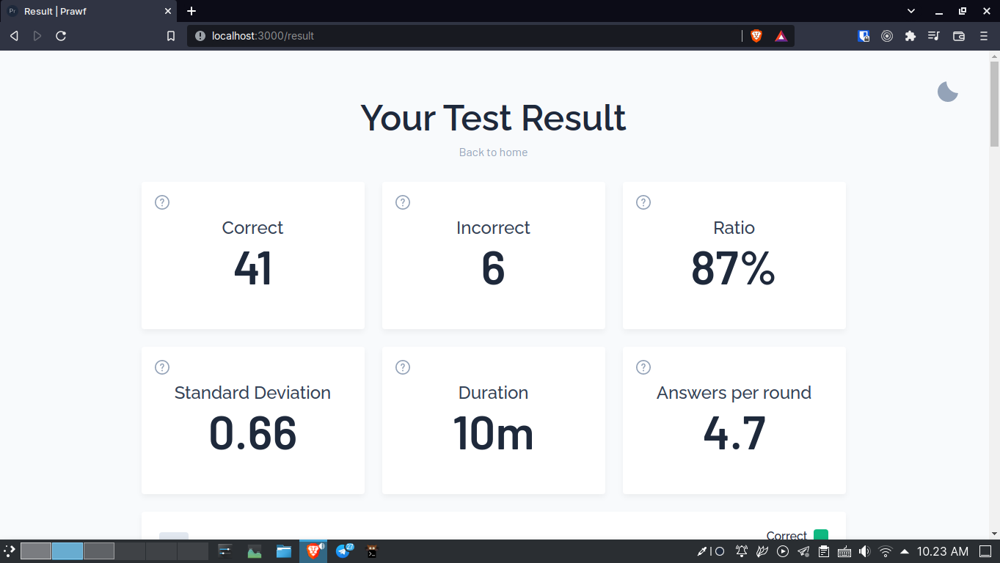
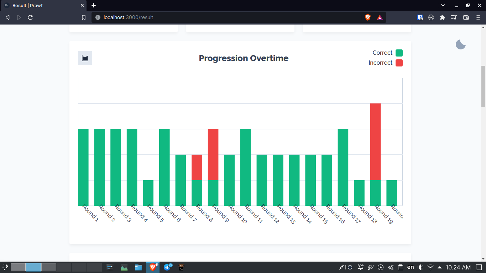
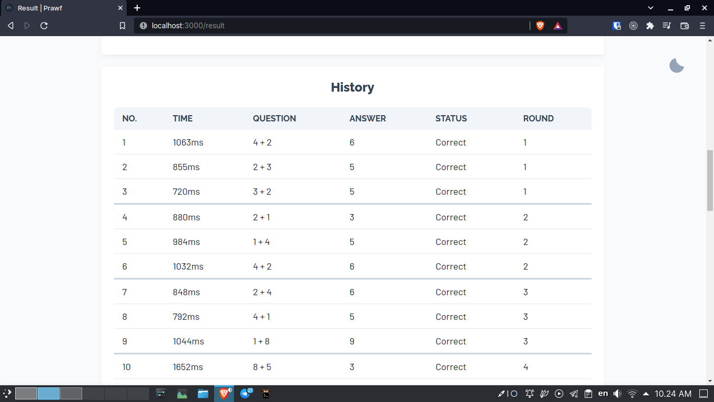

# Prawf

> A Pauli Test simulation app made with Web Component and RxJS

## Motivation
There was a discussion quite a while ago in [Teknologi Umum](https://t.me/teknologi_umum)
about brain throughput or something. Basically it was about how long does your
brain can maintain its performance. It was brought up because there was a
discussion about typing speed and how someone can get high Words per Minute at
the start but starts to slow down the longer they go.

There are several ways to test the brain throughput. One of them is Pauli Test.
It's a quite well known test and it's usually done using a piece of paper with
a bunch of numbers on it.

## Tech Stack
I didn't pick SPA library/framework or whatever you want to call it because I
want to try something new that I haven't really explored before, which brings
me to Web Component. I also use RxJS because I like it and it makes the process
so much easier.

Obviously this won't be the most efficient app or something like that because
this is my first time combining those two not-so-familiar technology. There are
some stuff that could be improved like re-rendering several part instead of the
entire component.

[You can read this for more technical detail](https://elianiva.my.id/project/prawf)

## Screenshot
Here are some screenshots if you don't want to try it yourself

## Why the name?
Prawf means Test in Welsh. Why Welsh? Aside from it being a cool word, it's
because I chose it randomly from Google Translate :p

## Development
It's just a regular Vite vanilla-ts project with RxJS installed so you don't
need anything special. Just a browser, NodeJS, and a text editor.
